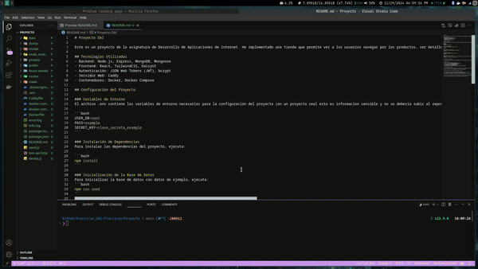

# Proyecto DAI

Este es un proyecto de la asignatura de Desarrollo de Aplicaciones de Internet. He implementado una tienda que permite ver a los usuarios navegar por los productos, ver detalles, utilidad de carrito y realizar busqueda. Ademas he implementado una ruta con React como ejemplo de SPA. La aplicación está construida con Node.js, Express, MongoDB y React.

## Tecnologías Utilizadas
- Backend: Node.js, Express, MongoDB, Mongoose
- Frontend: React, TailwindCSS, DaisyUI
- Autenticación: JSON Web Tokens (JWT), bcrypt
- Servidor Web: Caddy
- Contenedores: Docker, Docker Compose

## Configuración del Proyecto

### Variables de Entorno
El archivo .env contiene las variables de entorno necesarias para la configuración del proyecto (en un proyecto real esto es informacion sensible y no se deberia subir al repositorio):

```bash
USER_DB=root
PASS=example
SECRET_KEY=clave_secreta_example
```

### Instalación de Dependencias
Para instalar las dependencias del proyecto, ejecuta:

```bash
npm install
```

### Inicialización de la Base de Datos
Para inicializar la base de datos con datos de ejemplo, ejecuta:
```bash
npm run seed
```

###  Ejecución del Proyecto
Para ejecutar el proyecto en modo desarrollo, utiliza:
```bash
npm run tienda
```

### Construcción y Ejecución con Docker
Implementa todo lo anterior. Para la ultima práctica de despliegue **solo** hacer esto. Para construir y ejecutar el proyecto con Docker, utiliza:
```bash
docker-compose -f docker-compose-prod.yml up --build
```


## Configuración del Servidor Web

El servidor web está configurado con Caddy. El archivo Caddyfile contiene la configuración necesaria para servir la aplicación y manejar errores 404.


## Archivos Importantes

- **tienda.js**: Archivo principal del servidor Express.
- **routes/router_tienda.js**: Rutas relacionadas con la tienda.
- **routes/router_usuario.js**: Rutas relacionadas con los usuarios.
- **routes/router_api.js**: Rutas relacionadas con la API.
- **public/404.html**: Página personalizada de error 404.
- **Dockerfile**: Archivo de configuración de Docker.
- **docker-compose-prod.yml**: Archivo de configuración de Docker Compose para producción.


## Cosas Extra para nota implementadas

- Hacer una copia de seguridad de la BD (mongodump) Bajarse también los archivos de imagen de los productos, y guardarlos en una carpeta

- Hacer que el icono del carrito este deshabilitado si no se ha comprado ningún producto.


- Usar contraseñas cifradas como en Password hashing in Node.js with bcrypt


- Poner un páginador al primer endpoint: GET /api/ratings?desde=0&hasta=4 para sacar los 5 primeros ratings.
- Poner un logger en la apliación como en A Complete Guide to Winston Logging in Node.js.

- Hacer una actualización optimística, es decir actualizar primero las estrellas como si el api fuese a funcionar bien, y en caso de que no, mantener lo que había. 


- Poner a funcionar el botón Buy now de cada producto, para que muestre una página de detalle del producto (como en Sharing data between components).

- Incluir una página de Error 404 como en Set up a custom 404 page for static sites with Caddy 2


## Ejemplo

