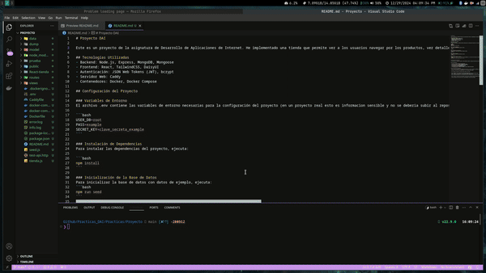

# Practicas_DAI

Este es un proyecto de la asignatura de Desarrollo de Aplicaciones de Internet. He implementado una tienda que permite ver a los usuarios navegar por los productos, ver detalles, utilidad de carrito y realizar busqueda. Ademas he implementado una ruta con React como ejemplo de SPA. La aplicación está construida con Node.js, Express, MongoDB y React.

Para más informacion esta en la ruta 

```bash
./Practicas/Proyecto
```

